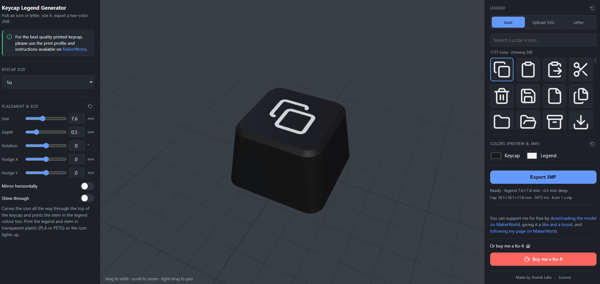
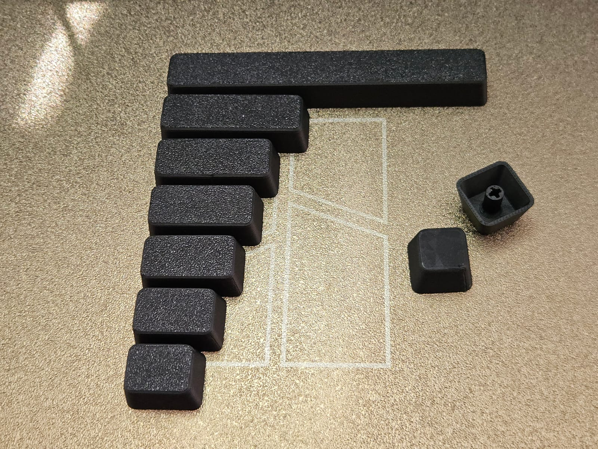

# Keycap Legend Generator

Local web app to drop an SVG icon or typed letter onto a keycap and export a
**two-color 3MF** (keycap body + legend body) for printing the cap face-down in
two filaments.



Printed results (use the [MakerWorld print profile](https://makerworld.com/en/@Vostok_Labs)
for best quality):

| All sizes | Icons & SVG logos | Shine-through |
| --- | --- | --- |
|  |  |  |

## Run

```bash
npm install
npm run dev       # opens the app
```

The converted keycaps (`public/keycaps/*.json`) are committed, so a fresh clone runs
without a build step. You only need `npm run convert` if you change the source CAD — see
[Add or swap keycap sizes](#add-or-swap-keycap-sizes).

## Use

1. Choose the **Keycap size** (1u … spacebars) from the dropdown in the left panel.
2. Pick an icon from the gallery (or **Upload SVG**) or switch to **Letter** and choose a font.
3. Set **Size**, **Depth** (default 0.5 mm), rotation and nudge. The legend is centered on the dish.
4. Choose the two colors (used in the preview and written into the 3MF).
5. **Export 3MF** → open in PrusaSlicer / OrcaSlicer / Bambu Studio.

In the slicer the file loads as one object with two parts (*Keycap* + *Legend*),
already colored. Assign a filament to each, then orient the cap **top-face-down**
to print the legend color as the first layers.

## How it works

- `scripts/convert-keycap.mjs` tessellates every STEP file in `Step files of keycaps/`
  (via `occt-import-js`) into one `public/keycaps/<id>.json` each — shell + stem(s) plus
  metadata (bounding box, top Z, dish bottom) — and a `public/keycaps/index.json` manifest
  that fills the size dropdown. The default unit is also written to `public/keycap.json`.
- The chosen SVG icon or generated letter outline is extruded into a tall prism over
  the legend footprint. Two booleans (`three-bvh-csg`) split the cap:
  `cap ∩ prism` → the legend body (its top **is** the real
  dished surface, ≥ depth thick), `cap − prism` → a perfectly matching pocket.
- `src/export3mf.js` zips both meshes into a 3MF with two base materials.

## Add more icons

Drop `*.svg` files into `public/icons/` — they appear in the gallery on refresh.
Single-color outline icons (e.g. [Simple Icons](https://simpleicons.org)) work best.

## Add more fonts

Use **Import font** in Letter mode to load a local `.ttf`, `.otf`, or Three.js
`.typeface.json` font. Imported fonts are available for the current browser session.

## Add or swap keycap sizes

The source `.stp` CAD files are **not** tracked in the repo (they're large and redundant
once converted) — only the generated `public/keycaps/*.json` are committed. To add or
change a size, drop `.stp`/`.step` files into `Step files of keycaps/` (git-ignored) and
re-run `npm run convert`, then commit the updated JSON.

Each file becomes a size in the dropdown. The unit and variant are read from the file
name: `1,25 u.stp` → "1.25u", `2 u, 3 stems.stp` → "2u (3 stems)", `6,5 u spacebar.stp`
→ "6.5u Spacebar" (use a comma for the decimal). Each STEP should hold the cap shell plus
its switch stem(s) as separate solids.
